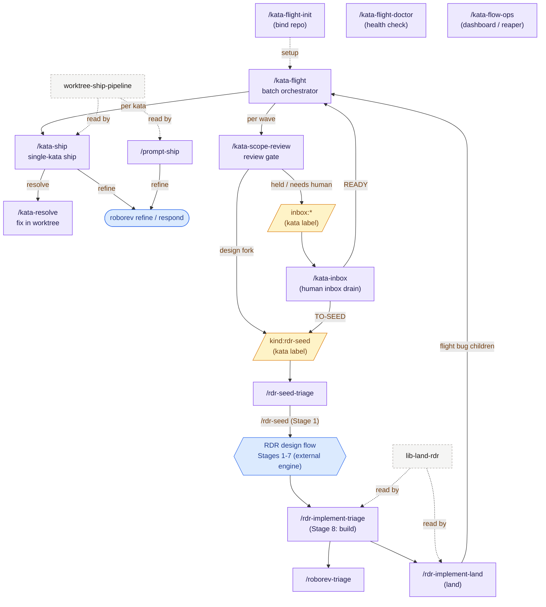
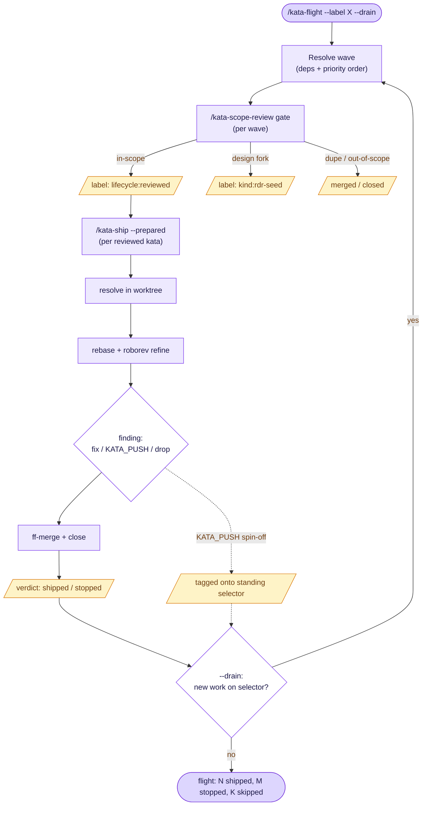
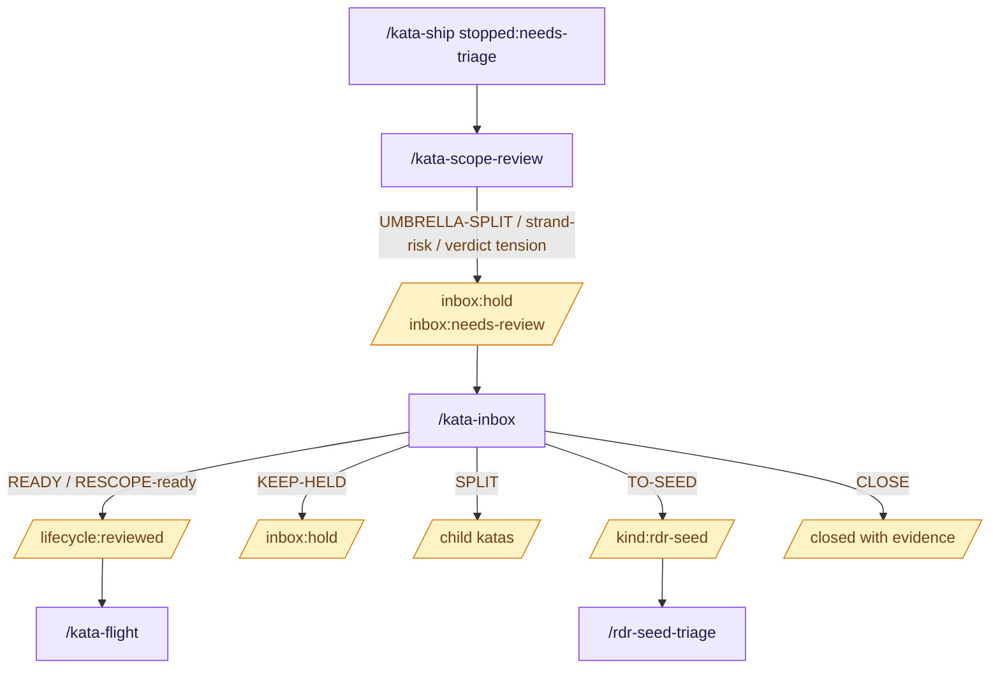
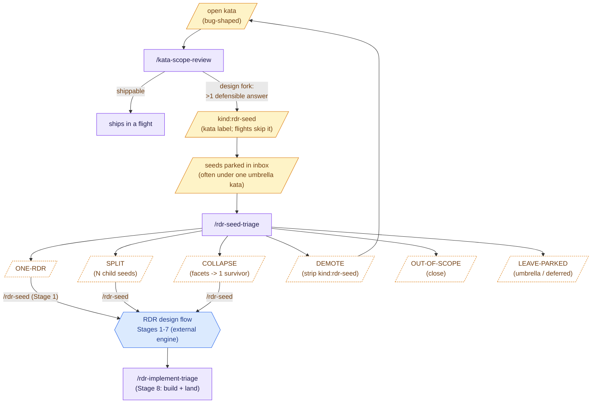
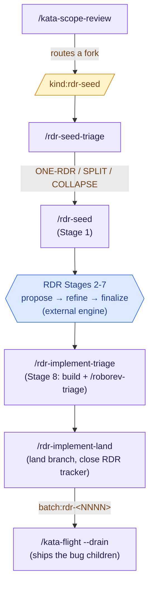

# Kata Flight Architecture

How the skills fit together: which are entry points, which orchestrate others,
which are shared libraries read (not invoked), and the two loops that do the
real work — the **flight/review ship loop** and the **rdr-seed peel-off**.

For per-skill detail, read the `SKILL.md` in each skill directory; each carries
its own *See also* section. This file is the bird's-eye map and does not restate
that detail.

## Skill roles

Skills fall into four kinds. The kind determines how you use it: entry points
are what you invoke, orchestrators fan out to others, leaves run inside an
orchestrator, and libraries are *read by reference* (cited by `§anchor`) and
never invoked.

| Skill | Kind | Subsumed by / read by | One-line role |
| --- | --- | --- | --- |
| `kata-flight-init` | entry (setup) | — | Bind a consumer repo to the suite; run once. |
| `kata-flight-doctor` | entry (read-only) | — | Verify the seam, engine, and skill links. |
| `kata-flow-ops` | entry (read-only) | — | Dashboard + reaper over the lifecycle labels. |
| `kata-inbox` | entry / orchestrator | consumes `inbox:*` output | Human-approved disposition of `inbox:hold` / `inbox:needs-review` katas. |
| `kata-flight` | entry / orchestrator | — | Ship a batch: order a wave, review-gate it, ship each kata. |
| `kata-ship` | orchestrator | invoked by `kata-flight` (also standalone) | Ship one kata end-to-end: resolve → refine → merge → close. |
| `kata-resolve` | leaf | invoked by `kata-ship` (Phase 1c) | Fix one kata inside an isolated worktree. |
| `kata-scope-review` | entry / orchestrator | invoked by `kata-flight`'s review gate | Consolidate/dedupe/route a batch before it ships. |
| `roborev-triage` | orchestrator | invoked by `rdr-implement-triage` | One-pass triage of roborev findings into follow-up katas. |
| `rdr-seed-triage` | entry / orchestrator | consumes `kata-scope-review` output | Drain the `kind:rdr-seed` backlog into RDR-ready shapes. |
| `rdr-implement-triage` | entry / orchestrator | — | Build an RDR (Stage 8) + chain triage, unattended. |
| `rdr-implement-land` | entry / orchestrator | — | Land a built RDR branch and flight its bug children. |
| `prompt-ship` | entry / orchestrator | — | Run a free-form prompt through the ship pipeline (no kata). |
| `worktree-ship-pipeline` | library (read-only) | read by `kata-ship`, `prompt-ship`, `rdr-implement-*` | The shared worktree/refine/merge protocol; cited by `§anchor`. |
| `lib-land-rdr` | library (read-only) | read by `rdr-implement-land`, `rdr-implement-triage` | The shared RDR-landing tail; cited by `§anchor`. |
| `using-git-worktrees` | library / playbook | generic | Worktree-isolation guidance. |

**Reference libraries are not slash commands.** `worktree-ship-pipeline` and
`lib-land-rdr` are read by their consumers (which cite them by `§anchor`) so the
ship/landing mechanics live in one place. Invoking them directly does nothing
useful — they have no top-level entry behavior.

## The map

Diagram legend: a **leading `/` marks an invokable skill** (slash command).
**Purple rectangle = skill**, **amber parallelogram = kata label / issue
state**, **diamond = decision**, **hexagon = the external RDR engine's
multi-stage flow**, gray dashed box = reference library (read by `§anchor`, not
invokable), blue stadium = external `roborev` tool. The same convention is used
in every diagram below.



## The flight / review ship loop

`kata-flight` is the batch driver. Each **wave** is resolved once (ordered by
dependency then priority), passed through the scope-review gate, then shipped
kata-by-kata. Review and ship are **pipelined**: a kata enters the ship loop the
moment its own `lifecycle:reviewed` stamp lands, while its siblings are still
under review.



Key properties:

- **Sequential ship.** kata-ship fast-forward-merges against the captured target
  branch, so katas ship one at a time — no parallel merges.
- **Review gate by default.** Every wave is scope-reviewed before it ships;
  `--no-review` skips it. The gate disposes autonomously (close dupes, route
  forks to `kind:rdr-seed`, hold via `inbox:*`) unless `--confirm` is set.
- **roborev refine inside each ship.** kata-ship runs `roborev refine` on the
  rebased branch; a finding is either fixed in place, spun off as a new kata
  (`KATA_PUSH:`, labeled `src:roborev`), or dropped as a false positive via
  `/roborev-respond`.
- **Spin-offs stay in the batch.** A `KATA_PUSH` kata is tagged onto the
  flight's standing selectors (`--parent`/`--label`) so a `--drain` re-sweep
  picks it up instead of orphaning it.
- **`--drain` re-sweeps** the standing selectors wave after wave until one
  yields no new eligible kata — the only way a flight absorbs work filed after
  it started.
- **Verdict is verified, not reported.** A kata counts `shipped` only when
  `kata show` confirms it closed + unlabeled + unowned, never because kata-ship
  narrated success.

The final report is a single block, e.g.:

```
flight: 2 shipped, 0 stopped, 3 skipped [over 2 waves]
  shipped: r80x=e05b85d 8hrd=6274172
  stopped: (none)
```

Common stops: `lost-claim-race` (another session owns the kata),
`worktree-prep-failed`, `not-shipped` / `not-shipped-after-resume`, and the two
user-gated tiebreakers — rebase conflict and multi-target auto-mode.

## The human inbox

`inbox:*` is the non-flight human decision lane. It is deliberately separate
from `kind:rdr-seed`: a seed has already been identified as design-fork backlog
and belongs to `rdr-seed-triage`; an inbox item needs a human-approved
disposition before it can return to a routed owner.



`kata-inbox` mirrors `rdr-seed-triage` operationally: selector-driven, no bare
whole-backlog drain, one compact grounded summary per item, then a human choice
among legal dispositions (`READY`, `KEEP-HELD`, `RESCOPE`, `SPLIT`, `TO-SEED`,
`CLOSE`, `REHOME`). The skill owns the tracker mutations and verifies read-back
state after every change.

## The rdr-seed peel-off

Not every kata is a bug to fix. Some encode a **design fork** — a decision with
more than one defensible answer. The scope-review gate recognizes these and
routes them to `kind:rdr-seed` as a terminal verdict (it then skip-filters
seeds, treating them as already-handled). Seeds accumulate in the RDR seed
backlog; `rdr-seed-triage` drains that backlog in an independent session and
shapes each seed into a clean input for the RDR flow.



`/rdr-seed` is only **Stage 1** of the external RDR engine; it *enters* the
design flow (Stages 1-7), which runs to a build-ready RDR. Kata Flight's
`/rdr-implement-*` skills pick up **Stage 8** (build + land). The amber
parallelograms (`kind:rdr-seed`, the verdicts) are kata label states; the purple
rectangles are the skills that act on them; the hexagon is the external engine.

The verdict taxonomy (decided per seed by `rdr-seed-triage`):

| Verdict | Meaning | Routes to |
| --- | --- | --- |
| `ONE-RDR` | one well-bounded fork, one load-bearing contract | `/rdr-seed <id>` |
| `SPLIT` | entangles >1 independent contract | N child seeds, one per contract |
| `COLLAPSE` | K seeds are facets of one contract | one survivor seed; `/rdr-seed <survivor>` |
| `DEMOTE` | not a fork — one obvious implementation | strip `kind:rdr-seed` → back to the bug flow |
| `OUT-OF-SCOPE` | already decided by a landed RDR, or moot | `kata close` |
| `LEAVE-PARKED` | umbrella/container or deferred seed | left as-is, surfaced |

`kata-scope-review` **fills** the seed bucket; `rdr-seed-triage` **drains** it.
They share ~80% of their machinery (the second cites the first by `§anchor`) but
are deliberately separate — the flight gate depends on scope-review staying
stable, so the two are never merged.

## End-to-end: a kata's RDR life

When a fork becomes a full RDR and lands, the work flows back into the same
flight loop as ordinary bug children:



The RDR engine itself is external (see [README](README.md) *Optional
Integration*); Kata Flight binds to it via `kata-flight-init --rdr-home`. The
`rdr-*` skills stop with a clear message when no RDR home is bound.

> **roborev: refine vs. triage.** Inside a *ship*, kata-ship runs `roborev
> refine` on the rebased branch (loop above). After an *RDR implementation
> launch*, `roborev-triage` replaces inline refine — it captures findings once,
> unattended, and files them as `src:roborev` follow-up katas (bug-shaped or
> seed-shaped) carrying the `batch:rdr-<NNNN>` label, so a later
> `kata-flight --label batch:rdr-<NNNN>` ships them. The split exists because
> un-grounded refine loops flap: roborev does not see the RDR evidence base, so
> deferring findings to katas beats re-litigating them every iteration.

## Gotchas

A few behaviors that surprise operators (and the invariants that exist because
of them):

- **Never wrap a per-kata ship in a sub-agent.** kata-ship spawns its own phase
  agents; a sub-agent cannot spawn (`Task is not available inside subagents`),
  so wrapping it stalls the ship. `kata-flight` invokes `/kata-ship` inline at
  the top level for exactly this reason (its *Why no per-kata sub-agent*
  section).
- **`kata show --json` is lossy.** It does not reliably project `priority` or
  `labels`; the agent/text view is authoritative for those. Cross-check rather
  than trusting an empty `--json` priority/label field. (`kata list --json` is a
  different, also-quirky shape — see kata-flight *Resolution*.)
- **Verify, don't trust the narration.** A ship agent can claim success (or
  blame a pre-existing failure) wrongly; the flight re-checks kata state with
  `kata show` and has caught false ship claims in practice. This is why
  `shipped` means *verified closed + unlabeled + unowned*.
- **A leaked worktree is not a stop.** The kata still records `shipped`, tagged
  `(worktree leaked: <path>)` in the report — the flight does not try to remove
  someone else's debris.
- **rdr-seeds park, they don't ship.** Seeds are commonly collected under a
  single umbrella kata (e.g. `umbrella: parked RDR-seed katas`) and drained in
  periodic `rdr-seed-triage` batches, not continuously.
