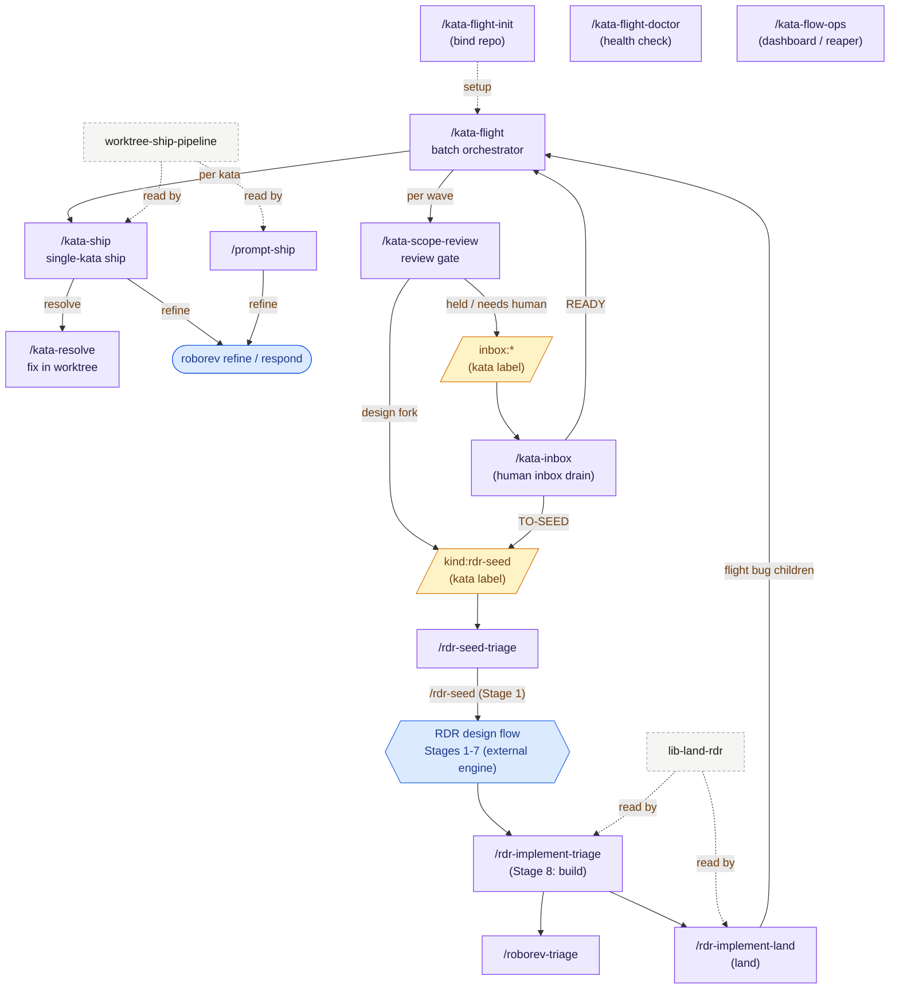

# Kata Flight

Kata Flight is a Claude Code and Codex plugin that wraps `kata` issue
resolution, `roborev` review handling, and optional RDR-backed planning into a
repeatable shipping workflow.

It is intentionally only a skill repository. The runtime dependencies are the
`kata` and `roborev` CLIs, plus any agent harness that can install local skills.
RDR support is a binding to an RDR process, not an embedded copy of RDR.

## How It Fits Together

`kata-flight` drives a batch: it orders a wave of katas, runs them through the
scope-review gate, and ships each one with `kata-ship` (resolve → roborev refine
→ fast-forward merge → close). Design-fork katas peel off to `kind:rdr-seed` and
enter the RDR track; RDR implementations land and flight their bug children back
through the same loop.

In the diagrams: a **leading `/` marks an invokable skill** (slash command);
**purple rectangles are skills**, **amber parallelograms are kata label/issue
states**, the **hexagon is the external RDR engine's multi-stage flow**, gray
dashed boxes are reference libraries (read by `§anchor`, not invokable), and the
blue stadium is the external `roborev` tool.



See [ARCHITECTURE.md](ARCHITECTURE.md) for the skill-role table, the
flight/review ship loop, and the rdr-seed peel-off in detail.

## Runtime Dependencies

- `kata` — local-first issue tracking. Install and docs:
  <https://katatracker.com/>. Go install:
  `go install go.kenn.io/kata/cmd/kata@latest`.
- `roborev` — local continuous code review for agents. Install and docs:
  <https://roborev.io/>. Quick install:
  `curl -fsSL https://roborev.io/install.sh | bash`, or
  `go install go.kenn.io/roborev/cmd/roborev@latest`.

## Optional Integration

- `rdr` — Recommendation Decisioning Records, the external RDR process the
  RDR-aware skills bind to. Optional: kata-only skills work without it. Source:
  <https://github.com/cwensel/rdr>. Bind a checkout with `--rdr-home` or the
  auto-detection described under [Bind a Project](#bind-a-project).
- `arc` (Arcaneum) — optional corpus search for RDR/reference grounding, quotes,
  and prior art. Not a runtime dependency; init records whether `arc` is present
  but selects no corpora. Source: <https://github.com/cwensel/arcaneum>.

## Install

### Claude

```sh
/plugin marketplace add cwensel/kata-flight
/plugin install kata-flight@kata-flight
```

### Codex

```sh
codex plugin marketplace add /path/to/kata-flight
codex plugin add kata-flight@kata-flight
```

Plugin versions use SemVer in `.claude-plugin/plugin.json` and
`.codex-plugin/plugin.json`. Keep them in sync with `./bump.sh
<patch|minor|major|X.Y.Z>`, which also creates the release commit and `vX.Y.Z`
tag.

To confirm the install path works end-to-end in a clean container (no host
state touched), run the smoke test in [`test/install`](test/install/):

```sh
docker build -t kata-flight-installtest test/install
docker run --rm kata-flight-installtest
```

## Bind a Project

Run `kata-flight-init` once from the consumer repository:

```sh
/kata-flight-init
```

The init flow writes a repo-local seam at `.kata-flight/workspace`, plus
`.kata-flight/env.md` and `.kata-flight/resources.md`. It also writes
`.kata-flight/env` as a compatibility shim for skills that source a shell env
file directly, and `.kata-flight/.gitignore` so the per-machine seam stays out
of git without editing the repository's root `.gitignore`.

Use `--workspace` to write a shared parent marker at `.kata-flight-workspace`.
The resolver is nearest-wins: repo-local marker first, workspace marker second.
See [`workspace.example`](workspace.example) for the marker contract (the
`KATA_FLIGHT_*` variables a marker exports) and
[`kata-flight-seam-context.sh.template`](kata-flight-seam-context.sh.template)
for the optional `SessionStart` hook that pre-resolves the seam.

By default, init inherits a parent `$WS/.rdr-workspace` evidence context when it
exists, then auto-detects an RDR engine at `$WS/rdr` or `$WS/process/rdr` when
exactly one valid engine exists. Use `--context-root <path>` or
`--rdr-home <path>` for non-standard layouts. If no RDR home is bound,
RDR-aware skills treat RDR context as optional and stop with a clear message
when an RDR-only operation is requested.

The generated resources file records whether Arcaneum corpus discovery was
available, but it does not select corpora automatically. Use the project README
plus `arc corpus list` to make an explicit corpus choice when a review or RDR
task needs outside references.

## Skill Set

See [SKILLS.md](SKILLS.md) for the short index.
